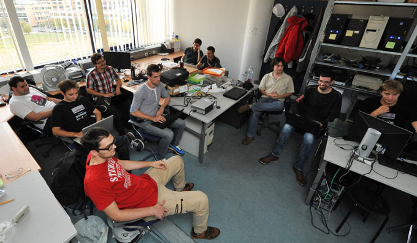

Summer just started in 2011, when [Gábor Pék](http://www.crysys.hu/~pek/), [Buherátor](https://twitter.com/buherator) and [Bencsáth Boldizsár (aka "Boldi")](http://www.crysys.hu/member/bencsath) decided to do some nice hacking over the summer instead of going to splash in Lake Balaton all summer long. The annual international university hacking competition called [iCTF](https://ictf.cs.ucsb.edu/) was a big challenge with top competing teams. These guys needed to pull up their socks to have a chance.
<!--excerpt-->

The guys were not new in hacking, but they never considered to compete before. They were typical self-taught hackers, reading blogs and hacker news, never learnt hacking in the classroom. They wanted to get better, so they assembled a cherry-picked list of security topics to practice for the competition:

* Basic hacking tools: [nessus](https://www.tenable.com/products/nessus-vulnerability-scanner), [nmap](http://nmap.org/), [nikto](https://cirt.net/Nikto2), [dirbuster](https://www.owasp.org/index.php/Category:OWASP_DirBuster_Project), [acunetix](http://www.acunetix.com/vulnerability-scanner/)
* Operating system tools: [bash](http://tldp.org/LDP/Bash-Beginners-Guide/html/), [perl](https://www.perl.org/), [python](https://www.python.org/about/gettingstarted/), [process explorer](https://technet.microsoft.com/en-us/sysinternals/processexplorer.aspx), [sysinternals tools](https://technet.microsoft.com/en-us/sysinternals/bb545021.aspx)
* [Web hacking magic](https://www.owasp.org/index.php/Category:OWASP_Top_Ten_Project): sql injection, XSS, CSRF, cookie jacking, session hijacking
* Memory-based vulnerabilities: [rop](http://cseweb.ucsd.edu/~hovav/talks/blackhat08.html), [bof](http://insecure.org/stf/smashstack.html), [format string](https://www.owasp.org/index.php/Format_string_attack)
* Hacks of the year: sony, anonymous, lulzsec
* Targeted attacks and APTs (advanced persistent threat)
* Malware disassembly
* Forensics: [volatility](http://www.volatilityfoundation.org/)
* Network handling: proxy, channeling
* Certificates, OTP
* Social network hacks: spear phishing, social spam
* Google hack DB

Most people were enjoying their vacation, but a small group of motivated students joined the effort. By September, the guys held regular meetings on Thursdays rigorously reviewing tools and hacks (with the help of some pizza and beer). The days of the iCTF 2011 competition came and [the team finished 36th](https://ctftime.org/event/22) (named as Team.iCTF.CrySyS.A). 

I think, this was the beginning of a beautiful friendship!

But, how did we get from this first CTF competition to compete twice at the [DefCon finals](https://legitbs.net/)? We will tell you in the next post.

In the meantime, we are creating [awesome tutorial challenges for you](https://platform.avatao.com/paths/ee29eaed-cd00-4a4d-b4bd-4e3cd83d714b/challenges/fa6e6174-2f17-11e6-bdf4-0800200c9a66) to try some of these hacker tools. Check out the hacking tools above in the list and comment if you want to suggest some tools.

