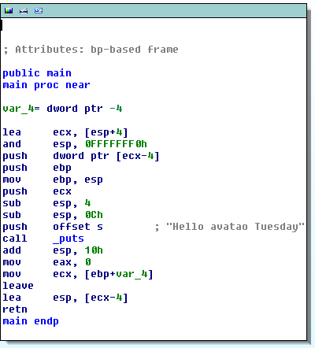

So here we are again with your next avatao Tuesday challenge. Today, we are delving a bit into reverse engineering by providing a small tutorial and a challenge to solve. 

A decent definition for reverse engineering comes from Eldad Eilam from  his [Reversing: Secrets of Reverse Engineering](http://eu.wiley.com/WileyCDA/WileyTitle/productCd-0764574817.html) book: "In the software world reverse engineering boils down to taking an existing program for which source-code or proper documentation is not available and attempting to recover details regarding its’ design and implementation." 

<!--excerpt-->

You can easily grasp the idea behind this definition if you write a simple C program, compile and disassemble it. For simplicity, we are going to create a simple Linux [ELF](https://en.wikipedia.org/wiki/Executable_and_Linkable_Format) binary with [GCC](https://gcc.gnu.org/)

So here is your first source code:

```c
#include <stdio.h>

int main()
{
    printf("Hello avatao Tuesday\n");
    return 0;
}
```

Let's create a 32-bit binary from this source code:

```sh
gcc -m32 -o re_challenge re_challenge.c
```

If you prefer 64 bit simply use `-m64`

```sh
gcc -m64 -o re_challenge re_challenge.c
```

There are various disassemblers available online in demo version (e.g., [IDA](https://www.hex-rays.com/products/ida/), [Binary Ninja](https://binary.ninja/demo.html)) or entirely free (e.g., [radare2](https://github.com/radare/radare2)). In this tutorial, we are going to use IDA to dissect our [32-bit binary](../downloads/re_challenge). If you simply open the binary in IDA you will see something similar:





The compiled binary contains instructions that can be executed by the CPU directly. The language which makes these machine instructions readable for humans is called [Assembly](https://en.wikipedia.org/wiki/Assembly_language). That is what we generally work with while reverse engineering binaries.

Every architecture comes with an instruction set which is typically documented by vendors. In our case, you can find the details in the [Intel 64 and IA-32 Architectures Software Developer  Manuals](http://www.intel.com/content/www/us/en/processors/architectures-software-developer-manuals.html).

In short, the code above first prepares space for the stack frame by aligning and moving the stack pointer by means of the `esp` CPU register. After that the code pushes the address of the `Hello avatao Tuesday` string to the stack and calls the `puts` function. Due to the `cdecl` [calling convention](http://www.agner.org/optimize/calling_conventions.pdf) `puts` will search its function argument on the top of the stack where the address of our string is located. 

For more information about the topic we suggest to read Dennis Yurichev's [guide](https://github.com/dennis714/RE-for-beginners).


**All right. I am sure that after this small introduction you can solve the [second avatao Tuesday challenge](https://platform.avatao.com/paths/2bf3c9cb-f759-4915-9a2f-f30164c45fce/challenges/82aced6a-baa8-4380-a553-a14ca304283d) on reverse engineering!**