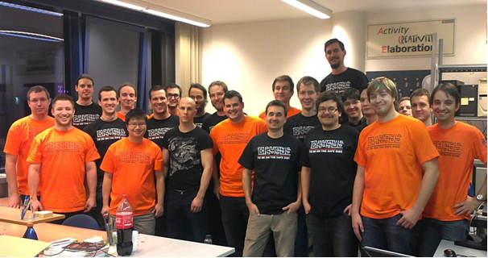
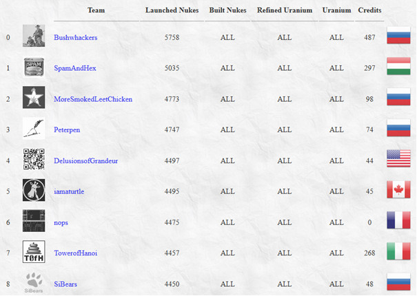
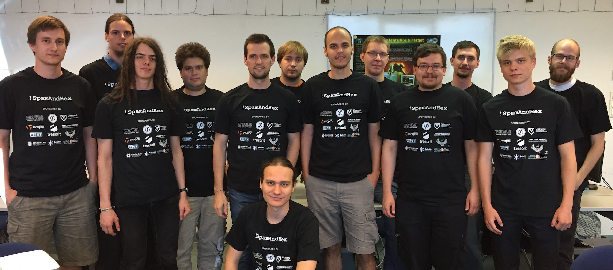

This is the final part of this blog series. If you haven't done already so, you can read the 
[first](https://blog.avatao.com/How-SpamAndHex-became-top-hacker-team/) and 
[second part](https://blog.avatao.com/How-SpamAndHex-became-top-hacker-team-2/) of our story also. 
It was early 2013, in the middle of my PhD studies when two master students (András Gazdag and Levente Fritz) asked 
me to talk about memory corruption vulnerabilities. It seemed to be a good idea, as there weren't any lectures about it 
on our university ([Budapest University of Technology and Economics](https://www.bme.hu)) at that time.
 
<!--excerpt-->

I like approaching problems and tasks systematically, so preferred doing it on a regular basis by involving other interested 
students also. That was the point when we contacted Levente Buttyán (head of CrySyS Lab) for his support.
He liked the initiative very much, so we decided to invite the best students from previous years' Security Challenge. 
Fortunately, all the invited students joined us and a couple of weeks later we formed our learning group which we call 
CrySyS Student Core since then. 

It was a really great beginning, we had many smart and interested students around us. The only thing we needed was to 
make them even more motivated. I chose some topics that were appealing enough (e.g., memory corruption, 
virtualization security, malware analysis, reverse engineering, etc) and started to talk about the complex, but amazing world
of system security to some excellent students week by week. We did not have a room at the beginning, 
but we projected my slides on the corridor wall at our department. After around two months it was time to 
involve students more deeply: fortunately, many of them were motivated enough to present a topic they were interested in. 
From this point on, we scheduled a speaker for each session and a topic to talk about. Soon we set up some rules to keep the group
running as follows.

## CrySyS Student Core 
The CrySyS Student Core is an invite-only group of students from our university who feel enthusiasm for
various domains of IT security and who have already proven their aptitude. One way to get invited is to score
among the best students at our CrySyS Security Challenge, which is a hacking contest that we organize for our
students every year. Another way is to provide an impressive performance during a student semester project that
we supervise. Thus, students who get invited have already achieved something, and they have a certain
level of expertise in a specific IT security domain (e.g., reverse engineering programs, hacking web sites, or 
breaking cryptographic protocols). 

We meet once every week (including the holiday seasons), and discuss various topics in IT security. Very often, 
we prepare talks on topics that we have been studying or working on recently, and present our experience to each other. 
For instance, a student would explain his discovery of a software bug and a following exploit discovery. 

Another common activity is to prepare for international CTF games. This preparation usually means that 
we give brief tutorials on various topics to each other, discuss write-ups for challenges from previous CTFs, 
or solve CTF challenges from previous years together. Occasionally, we invite an external expert to give a talk on a specific topic.

## Giving birth to !SpamAndHex

One measurable indicator of success is the steady improvement of our group’s results at international CTFs. 
Before founding the Student Core, we participated only the yearly iCTFs, and we didn't have a real track record on the global 
landscape of CTF teams. Our iCTF team was called Team.iCTF.CrySyS.A in 2011 which ranked 36th and Team.iCTF.CrySyS.B 
in 2012 (ranked 23rd). After founding the Student Core in April, 2013 some students, for example, Dániel Bali, Tamás Koczka, 
Gábor Ács-Kurucz, Zsombor Lázár showed special interest in playing more CTF games. They participated on many-many online CTFs. 
After a couple of months, we knew that we need a team name to play with on international CTFs. We had many idea 
in our mind, but we finally concluded that !SpamAndHex is the best choice. Practically, we polished 'Ham and eggs' little a bit.

In December 2013, we played again on iCTF as team !SpamAndHex for the first time with this name. We invited other students 
also from our university, but the key people of our team were all Student Core members. We tried our best, and we ranked 2nd. 
We could not believe it! Wow. It was an huge success for us! Something began at that point. 
   

(The !SpamAndHex team on iCTF 2013)

(iCTF 2013 scoreboard)

We did not stop here. Next year, in 2014, we got into the Final of Nuit du Hack and 5 of us (i.e., Dániel Bali, Gábor Molnár, 
Gábor Vaspöri, Gábor Ács-Kurucz and Tamás Koczka) flew to Paris. These guys did their best and scored 3rd in their
very first Final. The rest of the team, who stayed at home hardly waited to shake their hands and congratulate. 
This year we played 28 CTFs and ranked 14th on the global ranking of ctftime.org, the world-wide ranking of all CTF teams.

After a couple of years of experience in CTF games we knew that we can do it even better. The year of 2015 brought us the 
real success. However, some of our members had to pay the cost of it seriously. For example, Tamás Koczka, Gábor Ács-Kurucz and 
Dániel Bali participated almost on every mentionable CTFs this year. Other members, including me, played mostly on dedicated CTFs.
So let's start 2015. First and foremost, we participated again on iCTF in April, 2015 (referred as iCTF 2014!) and we won it! 
We invited many other talented students also from our university, but the key members were from the Core. 

Our story did not stop here. We played many CTFs with some really good results, however, the real challenge was 
still ahead us. If you are a top team, you must play in the DEFCON CTF Finals. There are two ways to qualify for the
DEFCON CTF Finals. Either you win one of the selected CTF games like Boston Key Party, HITCON CTF or you get in from the official
qualifier. We took the second path and for the first time in the history a Hungarian team qualified for the DEFCON
CTF Finals in 2015. I was very proud to the team that practically did not exist two years before.

(The !SpamAndHex team is preparing for the DEFCON CTF 2015 Finals)

In 2016, we did no have as much time to participate at CTFs as in 2015, but we concentrated on the major events. We 
intentionally practiced for the DEFCON qualifier and we got into the Finals again. 

We were lucky to play against the best teams in the world at the 24th DEFCON CTF Finals in Las Vegas. However, it was not 
as easy as it seemed to be. This year was fairly different from any other years before. For the first time in history,
teams had to play against the DARPA Cyber Grand Challenge winner machine Mayhem from ForAllSecure.
 
We will keep on rolling! I am really grateful to the !SpamAndHex team members to have achieved these successes and raised
 awareness of IT security in Hungary and beyond. 
