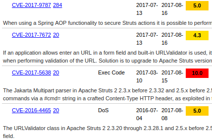

You've probably read about the Equifax breach [in NY Times](https://www.nytimes.com/2017/09/07/business/equifax-cyberattack.html), [in Bloomberg](https://www.bloomberg.com/news/articles/2017-09-18/equifax-is-said-to-suffer-a-hack-earlier-than-the-date-disclosed) or somewhere else. The breach resulted in the leakage of 143 million user profiles, 
including Social Security numbers, birthdates and addresses. Needless to say that these are very sensitive resources in the hands 
of identity thieves, so many Equifax users are really unhappy now. The breach has serious consequences as almost half of the US population is affected. As a result, the [CEO](https://www.washingtonpost.com/news/the-switch/wp/2017/09/26/equifax-ceo-retires-following-massive-data-breach/), [CIO and CSO](https://www.washingtonpost.com/news/the-switch/wp/2017/09/15/two-equifax-executives-will-retire-following-massive-data-breach/) had to go. Some claim that it was not only their fault, the reason was also the [lack of skilled staff](https://www.linkedin.com/pulse/equifax-breach-what-one-talking-deidre-diamond/). 

In this post, we will have a look at the technical details of the Equifax breach and learn how this could have been prevented.

<!--excerpt-->

Equifax is using Apache Struts, an open-source MVC Java framework for their web-application. 
Struts is a popular target for attackers as approximately 65% of Fortune 100 companies use Struts-based applications [according to statistics](http://www.zdnet.com/article/critical-security-bug-threatens-fortune-100-companies/).
In the past year several vulnerabilites have been found in the software and two of them were RCE (Remote Code Execution) bugs.
In case of an RCE, attackers could run code on vulnerable servers, which allows them almost anything they want: to steal company secrets or customer data, upload ransomware, inject malicious code into the web-applications and much more. It's no fun to let evil visitors run their code on our servers.

The [first vulnerability](https://www.cvedetails.com/cve/CVE-2017-5638/) has been found in the Jakarta Multipart parser on March 10, 2017.
It turns out that invalid Content-Type headers are not processed as text but as [OGNL code](https://commons.apache.org/proper/commons-ognl/).
These native payloads will be converted to executables and dropped in the server's temp dir. It's as dangerous as it sounds, no wonder it has a maximum (10.0) score on [CVE Details](https://www.cvedetails.com/cve/CVE-2017-5638/).

Immediately patching CVEs (in hours, but at least in few days) should be self-evident, 
however many companies are failing to update known vulnerable components for months or even years and it looks like Equifax is one of them. Let's see the timeline of events:

 * **March 10, 2017** Publish date of [CVE-2017-5638](https://www.cvedetails.com/cve/CVE-2017-5638/) (this vulnerability was exploited by the attackers)
 * **May 13 through July 30, 2017** Series of unauthorized accesses to sensitive files containing customer data on Equifax servers (based on the company's investigation)
 * **July 29, 2017** Equifax's Security team discovers the suspicious network traffic

We should understand that developing and patching processes are longer and more complex at large companies, although large companies
should understand the importance of patching security vulnerabilities as well, because their size is no excuse for leaving
private informations of their customers unprotected.

There are several tools which can help you find and fix security issues in your dependencies. 
If your software has 3rd party components as many applications today and you're not using one of the dependency checker tools, this could be the first step
to secure your application. One example is [Snyk](https://snyk.io/) that continuously finds and fixes vulnerabilities in your dependencies.

The second RCE vulnerability [CVE-2017-9805](https://cve.mitre.org/cgi-bin/cvename.cgi?name=CVE-2017-9805) 
(discovered on **September 5, 2017**) was in a plugin called `Struts REST`. It allows attackers to post
XML formatted data to application endpoints. The XML format is supported by a library called **XStream**, which can be used for
serialization (converting data structures or objects into a format that can be stored or transmitted and reconstructed later) as well.
That means, a specially crafted XML input could be translated into a malicious Java object and the code of the attacker will be executed.
You might think the web-application is vulnerable only if it is used with XML, but this is not the case. Struts REST is poorly configured by default, so installing this plugin makes the application vulnerable - even the `struts2-rest-showcase.war` official example application is exploitable.

You are wrong if you think you have to be a hardcore hacker to launch successful attacks against vulnerable Apache Struts instances. Exploiting public vulnerabilities is often just about parameterizing a python script with a URL.

**Test your hacking skills in our newest challenge and see how easy is to compromise servers running Apache Struts < 2.5.13 web-applications.** You will also find potential remedies and countermeasures to explain defense against this attack.
[Access challenge](https://platform.avatao.com/paths/2bf3c9cb-f759-4915-9a2f-f30164c45fce/challenges/0ba77e1c-d415-4951-b547-6d2b142a010a)

It's hard to implement deserialization securely, because after the serialized data is processed its code has already executed. **XStream** is very honest about it as you can see in their [Security Aspects](http://x-stream.github.io/security.html):

> The XML generated by XStream includes all information required to build objects of almost any type. This introduces a potential security problem.
> The provided XML data is used by XStream to unmarshal Java objects. This data can be manipulated by injecting the XML representation of other objects, that were not present at marshalling time. An attacker could take advantage of this to execute arbitrary code or shell commands in the context of the server running the XStream process.

Software is made by people, so don't assume it's flawless. You can, however, defend your application against many 0-day vulnerabilites too. If you are using 3rd party components, take your time to configure them properly, read the documentation, disable unnecessary features and remove extra libraries. These precautions can significantly reduce attack surface.

Let me summarize the most important takeaways from the Equifax story:

 * **[Validate user input](https://www.owasp.org/index.php/Data_Validation)** It's the root cause of many attacks (XSS, Command Injection, etc.)
 * **Configure your components properly** Turn off every feature you're not using to reduce attack surface.
 * **Monitor vulnerabilities and update your 3rd party softwares regularly** Train your DevOps and sysadmin team to prudently maintain third-party software or use automated solutions, like [Snyk](https://snyk.io/) or [Black Duck](https://www.blackducksoftware.com/).

See you next time!
