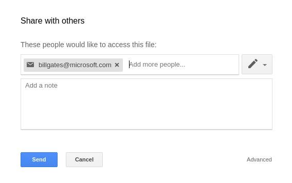
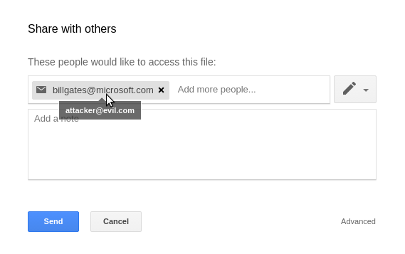

IT security is a really huge topic and until you find your first bug you can't be sure that you have the required amount of knowledge, luck, and patience. Joining the club of bug bounty hunters as a newbie is hard, so let me share my story with you.

<!--excerpt-->

----

## INVITE SPOOFING

I've found my first bug accidentally by trying to share a Google Spreadsheet with a teacher. (Un)fortunately, I've sent the invite to his non-Gmail address and then e-mailed him the link. Naturally, he couldn't access it... Luckily Google is so helpful, that in this case (when you try to open a document which is not shared with you) there is a `Request access` button below the error message, which sends an e-mail to the owner including a link like this:

```
https://docs.google.com/spreadsheets/d/cmFuZG9t_c3ByZWFkc2hlZXQ_aWQ/edit?usp=sharing_erp&userstoinvite=billgates@microsoft.com
```

If you open the link above as owner, the document will load and a 'Share with others' modal pops up prefilled with the e-mail address from the URL:



My first thought was "hmm.. the user input is reflected in the DOM - should I try XSS?", but my second thought instantly followed the first: "There's no way I'm the first one who found it. This is Google and there are lot of smarter guys in the world who're constantly trying to hack it. I won't waste my time with XSS payloads..."

You can call me a pessimist, but I have read some recent posts about XSS vulnerabilities on Google and they're much harder to find. However, something else caught my attention... The name of the parameter was `userStoinvite` instead of `usertoinvite`, which means it can be used to invite more users at once, right?

I started playing with this parameter and it wasn't hard to figure it out that if I separate the email addresses with commas, they will appear in the form. Just like when you want to send an email to multiple recipients... Okay, so if it works like writing email addresses, then let's see what happens if I specify a name:

```
https://docs.google.com/spreadsheets/d/cmFuZG9t_c3ByZWFkc2hlZXQ_aWQ/edit?usp=sharing_erp&userstoinvite=Bill Gates<billgates@microsoft.com>
```

It worked as I expected - the name was shown in the form instead of the address and the real email address behind the name was only displayed if you moved your mouse over it.



### What could go wrong?

If you use a fake email address instead of a name, you can craft a spoofed invite and trick inexperienced users into giving you access. 
An attack scenario: 
- You're no longer working for a company and your access to an important spreadsheet is revoked, but you still have the URL (e.g. in your browser history) 
- Send a spoofed invite link to the secretary/accountant with your ex-boss's email address 
- Wait until they open the link and give you access

Timeline: 
* 2017.10.03 - Bug reported 
* 2017.10.03 - Bug verified by a security engineer (P4 -> P3) 
* 2018.10.10 - $500 bounty awarded 
* 2018.01.16 - Bug fixed

## GETTING PICTURES FROM YOUR DRIVE

After my first bug I had mixed feelings. On the one hand, I was very proud and happy because I had found a security issue in Google and I really appreciated the bounty as well. On the other hand I wasn't really satisfied with myself, because anyone who ever sent an email, with some luck, could have found the bug - at this point I felt I could do better.
But where to start? I was sure that running automated tools would be a waste of time because I thought that's what other people are doing and I wanted to try something different. I thought I had a good understanding of the basic concepts of web (like SOP and CORS) and since I’d really fallen in love with the Chrome Dev Tools, I decided to start looking for insecure API endpoints and/or sensitive data in JS files.
My algorithm was the following:

```
for webapp in literally_every_online_google_product_I_have_found:
    devtools.open()
    devtools.select_tab('network')
    for button in webapp:
        button.click()
    for request, response in devtools.requests:
        request.analyze_manually()
        response.analyze_manually()
```

It was long and boring. I spent afternoons and nights reading the requests and responses with no success. I don't even remember how many different things I’d tried: 

 * "Maybe there are some vulnerabilities in this CSS... or how about these fonts?" 

 * "Ok, what if I replay this request with my other account's cookies?"

 * "Hmm, I can upload an SVG here. It's time for some XSS payloads".

I focused on Drive and the Google Docs family because they are connected (Docs has access to your files), popular (so a security flaw would mean a serious threat) and they have many features and settings. The first thing I had observed was that Slides is really similar to Docs and Sheets, however, it uses different (legacy?) API endpoints in some cases. For example, inserting an image from my drive triggered these two requests:

```
curl 'https://docs.google.com/presentation/d/pReS3nTaT10N_1D/copyimages?id=bG9s_Y2hlY2tvdXR0aGlz_dDY4UkV1MEh3Qnc' --data 'photo=bG9s_Y2hlY2tvdXR0aGlz_dDY4UkV1MEh3Qnc'

{"bG9s_Y2hlY2tvdXR0aGlz_dDY4UkV1MEh3Qnc":"MDRjYWVhO-QtYjc0Ny00NDdkLWJlODctZ-VmNzVkOTI1YTkw"}

---

curl 'https://docs.google.com/presentation/d/pReS3nTaT10N_1D/renderdata?id=bG9s_Y2hlY2tvdXR0aGlz_dDY4UkV1MEh3Qnc' --data 'cosmoId=MDRjYWVhO-QtYjc0Ny00NDdkLWJlODctZ-VmNzVkOTI1YTkw'

{"r0":"https://lh6.googleusercontent.com/dmVyeXZlcnl2ZXJ5dmVyeXZlcnl2ZXJ5dmVyeXZlcnl2ZXJ5dmVyeXZlcnl2ZXJ5dmVyeXZlcnl2ZXJ5dmVyeXZlcnl2ZXJ5dmVyeXZlcnl2ZXJ5bG9uZ3N0cmluZw"}
```

You should notice that the first response basically contains `"ID_OF_THE_IMAGE":"SOME_RANDOM_ID"`, and `“SOME_RANDOM_ID”` appears in the second request as the value of `cosmoId`. Also, the second response contains a direct link to the image.

I don't really see the reason behind using two API endpoints for processing an image because it feels a little overcomplicated - that's why I thought Slides had some legacy parts worth focusing on. So I replayed those requests above with different cookies. 

I prefer built-in tools so I copied the **cURL** command from the Chrome DevTools and replaced the `Cookie` header with the cookies from one of my other sessions. Fortunately, the authorization was missing from these endpoints, so with a valid Google session cookie I could get a direct URL of any picture from any drive (if I had the ID of the file)!

It sounds pretty cool, but the truth is that these image IDs are very long, case-sensitive strings. That’s why I can't foresee scary attack scenarios, which also explains the relatively low bounty for this Direct Object Reference vulnerability.

Timeline: 
* 2017.11.27 - Bug reported 
* 2017.12.09 - Bug verified by a security engineer (P3 -> P1) 
* 2018.01.09 - $500 bounty awarded 
* 2018.01.16 - Bug fixed

In a simulated environment, you can see [how this vulnerability worked](https://platform.avatao.com/challenges/630fa4fc-3138-4805-bd78-ea85e492c2e2) until 10th January '19. 

## PLEASE LOGIN TO GIVE ME YOUR PHOTOS

After these two bugs I took a break because I felt I had used all my luck and it needed some time to regenerate. In May I decided to give it another try and within 3 hours, I had found an awesome vulnerability. I thought it was too good to be true, so I checked it three or four times before reporting it.

On my first run I had somehow skipped Google Photos, so this time I started the bug hunting by focusing on it, using my good old method. 

Nothing notable on the Network tab, but the 'shared libraries (automatically share photos with a partner) feature' looked promising. If you want to set up a partner account you must type the email address of your partner first. After submitting it, a popup window appears with a Google accounts login screen. Finally, you need type your credentials, then your photos will be shared and you will be redirected to a page that only contains a 'Success message' and a 'Close window' button. The size of the popup prevented me from seeing the whole URL, so I copied it to the Notepad for further research:

```
// URL before login
https://accounts.google.com/signin/v2/sl/pwd?passive=133780085&osid=1&continue=https%3A%2F%2Fphotos.google.com%2Finitps%3Frequest%3DW1tudWxsLCIxMjU4NzQyNzU5MTIzOSJdLG51bGwsImUtbWFpbEBleGFtcGxlLmNvbSIsbnVsbCxbMixudWxsLCJXVzkxSUhKbFlXeHNlU0JzYVd0bElfR1JsWTI5a2FXNW5JSEpoYm1SdmJTQmlZWE5sTmpRZ2MzX1J5YVc1bmN5QXRJR1J2YmlkMElIbHZkVDgiXV0.

// URL after login
https://photos.google.com/initps?request=W1tudWxsLCIxMjU4NzQyNzU5MTIzOSJdLG51bGwsImUtbWFpbEBleGFtcGxlLmNvbSIsbnVsbCxbMixudWxsLCJXVzkxSUhKbFlXeHNlU0JzYVd0bElfR1JsWTI5a2FXNW5JSEpoYm1SdmJTQmlZWE5sTmpRZ2MzX1J5YVc1bmN5QXRJR1J2YmlkMElIbHZkVDgiXV0.
```
It was clear that the `continue` parameter contained the second URL encoded, but the value of `request`, at first glance, was just a bunch of random characters with a dot at the end. The dot just didn't make any sense - why did it only appear at the end, like some padding? If it was an equal sign, 'request' could have been a valid base64 encoded string, because the charset was the same... So I changed it, pasted the modified string into a base64 decoder and it actually worked:

```
[[null,"12587427591239"],null,"e-mail@example.com",null,[2,null,"WW91IHJlYWxseSBsaWtlI_GRlY29kaW5nIHJhbmRvbSBiYXNlNjQgc3_RyaW5ncyAtIGRvbid0IHlvdT8"]]
```

I changed the email to my own (without touching the other values), base64 encoded the payload and replaced the equal sign with a dot. After opening the crafted URL with it and logging in with my second account,  photos were shared with the first account. The best part was that I didn't even get a warning/notification/email about it. I couldn’t wait to analyze the vulnerability further.  Unfortunately, I have NOT tested what happens if you visit the second URL directly - it's possible that you don't even need to login to share your pictures with the attacker because sending a GET request to the second URL could be enough.

Timeline: 
* 2018.05.12 - Bug reported 
* 2018.05.14 - Bug verified by a security engineer (P4 -> P2, P2 -> P1) 
* 2018.05.22 - $3133.70 bounty awarded 
* 2018.08.22 - Bug fixed

Try [our challenge](https://platform.avatao.com/challenges/e069a6c1-8265-4115-9126-f8e188c62765) to understand this vulnerability better. It is available for free until 10th January '19. 

The hardest part was not knowing what to look for, which is true in most of the other bug bounty programs as well. The takeaway from these cases is not to limit yourself to specific vulnerabilities, like XSS or SQLi. Keep your eyes open and be creative.

## About the author

Gergő was one of the first members of the [Avatao](https://avatao.com/) team and now he is one of our best software engineers. His interest in web security has started at university and has not stopped since. He  develops his own challenges on [Avatao platform](https://platform.avatao.com/paths/e65ee304-7299-40d0-bdd1-93f35c381560/challenges/fa6e6174-2f17-11e6-bdf4-0800200c9a66) and also responsible for mentoring other content creators. In his free time he still hunts bugs. 
