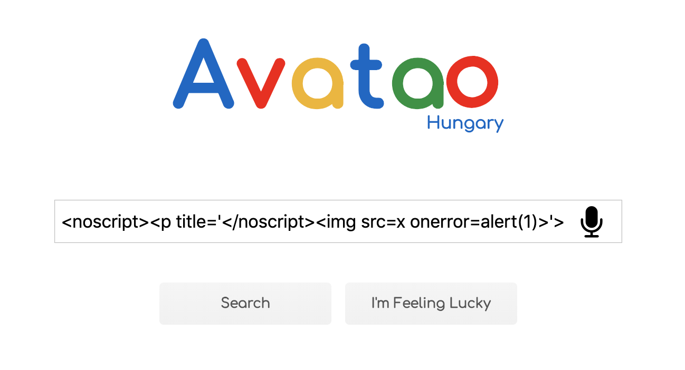

You have probably heard about the recent Cross-Site Scripting vulnerability in the Google search engine. With a clever payload you could have crafted a link which executes JavaScript after opening it and clicking into the input box.

The bug was found by [Masato Kinugawa](https://twitter.com/kinugawamasato){:target="_blank"} and [LiveOverflow has made a video about it](https://www.youtube.com/watch?v=lG7U3fuNw3A){:target="_blank"} which went viral!! (it really is worth checking it out plus you can find a lot of additional great stuff on his YouTube channel as well).

The video explains the bug clearly, but practice makes perfect so we have created a [tutorial challenge](https://platform.avatao.com/challenges/756c97e7-8605-4b5f-8c59-a6387f8fba67){:target="_blank"}  about the bug, where you can:

 * **Exploit the same vulnerability**
 * Play with the HTML parser of your browser
 * See how the vulnerable version of the sanitizer worked

Also we think it's worth highlighting the key elements and main points of the story, which is the goal of this post.



<!--excerpt-->

----

## Dealing with user input

Simply encoding special characters could have prevented the issue, but... in some cases you want to allow some HTML tags, for example when writing e-mails (formatting text, inserting links and images). It means you have to actually parse the code and remove its unwanted parts, like JavaScript and exotic attributes.

## Then let's sanitize it on client-side

It sounds really wrong - so why would Google do that? Because parsing HTML is not as easy as you may think. The specification is really complex and the implementation can be different in the browsers as well. Additionally, browsers don't just simply parse the HTML - they're fixing malformed code, completing missing tags, paying attention to headers, loading external resources. Implementing and maintaining a library for that would be really hard - especially because of the different versions of the different browsers. I guess using the client for that makes more sense now.

## But how to do it securely?

There is a very special `<template>` tag which is perfect for the job. Its content is parsed, but not rendered. That means the browser does its magic (like fixing the missing closing tags), but it won't execute scripts or load images. The basic concept of sanitizing HTML on the client is the following:

 * Loading the user input into a `<template>` tag and letting the browser parse it
 * Removing scripts and unwanted tags and attributes (by using a whitelist for example)
 * The result can now be used securely in the HTML code

## The issue

And here comes the `<noscript>` tag which is really special as well. The [specification](https://www.w3.org/TR/2011/WD-html5-author-20110809/the-noscript-element.html){:target="_blank"} says:

> The `noscript` element **represents nothing if scripting is enabled**, and **represents its children if scripting is disabled**. It is used to present different markup to user agents that support scripting and those that don't support scripting, by **affecting how the document is parsed**.

Inside the `<template>` element **scripting is disabled**, but in the browser (after using the sanitized HTML in the DOM) **scripting is enabled**. Combining this fact with the helpful behavior of the browsers (where they finish incomplete tags) led to the ultimate payload which could have been used to bypass the Google - Closure and the Cure53 - DOMPurify libraries (both are popular HTML sanitizers):

```
<noscript><p title='</noscript>'>
```

It's parsed inside the template element like this:


But when it's used in a scripting enabled context it becomes:


And boom - the `alert(1)` is executed. It's a really awesome example of how weird browsers could be and a motivation for all the bug bounty hunters out there. I bet almost none of us thought that we'd see a working XSS on the homepage of Google.

## How could it have been avoided?

The funny thing is that they (at Google) **knew about this attack vector** already and **fixed the code a long time ago**. However they didn't add any unit tests and when someone later reverted it, the build passed (because it didn't break the non-existent test) and the vulnerability ended up in the production code. So I think the most important takeway from the story is **tests are really important**.

## Why?

I've seen the video multiple times, checked many-many comments about this vulnerability and played with the JS debugger for hours, but none of these could answer **why was the user input parsed as HTML in the search engine?**, which is the real question here I think. But even if it wasn't the case - the payload probably could have worked in GMail.

## Let's play

Now it's your time to analyze the bug interactively by solving our [tutorial challenge](https://platform.avatao.com/challenges/756c97e7-8605-4b5f-8c59-a6387f8fba67){:target="_blank"} about it. Have fun!

