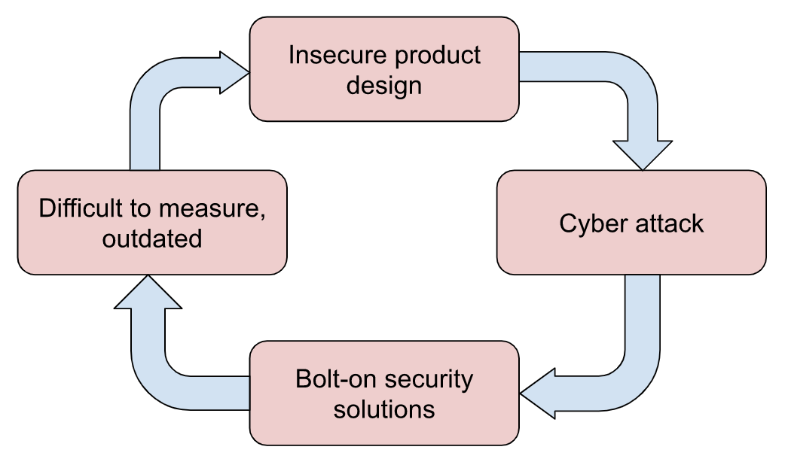

**Cybersecurity: a tough reality**

Cybersecurity is an inherently negative asset. As with any protective measure, the major challenge is to [measure the value (or Return on Investment, ROI) of cybersecurity](https://www.tripwire.com/state-of-security/security-data-protection/cyber-security/cybersecurity-roi-oxymoron/). It is significantly more difficult to make this value apparent to stakeholders: customers, users and decision-makers in the company. When all goes well, the investment in security is not really justified. When there is an attack and disaster hits, it is too late to think about fixing problems and so, the blame-game begins. 

Usually, companies that have been targeted by attacks mainly focus on putting out fires, that is to recover business operations and patch the obvious holes. 

Not only is security a negative asset, but is also a preventive one. 

Majority of the value of the investment made in security only shows up after the security defenses catch a major attack or when companies pass a tough business audit because of proper measures. In general, the [task of the Chief Information Security Officer (CISO) or another security leader for that matter is quite difficult](https://www.cio.com/article/3072940/why-the-ciso-is-the-hardest-tech-role-to-fill.html), because they need to prepare for the inevitable without any substantial evidence to justify the budget. 

That being said, it is not surprising to see many argue that [security in general is a dismal industry](https://www.zdnet.com/article/a-dismal-industry-the-unsustainable-burden-of-cyber-security/) that is not providing any stellar value to consumers, and yet demands a lot of resources.

**And yet, security is a must.**

In the early days of any industry, security isn’t usually a part of a product. When cars were first introduced, the emphasis was on functionality. Yet, a few years after the first car hit the market, the first car was stolen and security became an issue. 

As a response, the [first car alarm was invented](https://jalopnik.com/the-first-car-alarm-was-sort-of-like-a-puzzle-471797268). Similarly, the Internet was not designed with security in mind as it was initially a closeted and trusted research network for researchers.

As with any technology, once the major features are built and adoption is wide-spread, safety, reliability and security assume the status of bigger issues. 

The problem here is that security is often looked at as an afterthought, that solves point in time problems. 

When technology evolves, security solutions need to be replaced. Many argue that security should stop being a bolt-on solution and [should be part of the product design and development from the very beginning](https://www.zdnet.com/article/bolt-on-security-comes-under-fire/).

**The value of cybersecurity**

Here’s the ‘vicious’ cycle of cybersecurity: 

It is very important that all participants in software product design work together to break this cycle. Software developers need to build systems that are secure by design (especially in [web application security](https://platform.avatao.com/paths/c7b22cf2-3044-42ca-bfc4-308d3023034d/info), and [secure coding](https://www.pluralsight.com/browse/information-cyber-security/secure-by-design)). 

It is imperative we see that **[cybersecurity teams can deliver great value to the business](https://hbr.org/2016/09/how-cybersecurity-teams-can-convince-the-c-suite-of-their-value)** if they are treated as internal consultants and value centers rather than a cost center. The major problem is that developers and product managers need cybersecurity to be seamlessly integrated with product development. 

1. First, cybersecurity teams can and should be present during the design stage of any product. Product and developer teams should consider cybersecurity as a feature. It starts with [threat modeling](https://www.owasp.org/index.php/Application_Threat_Modeling) and continues with secure architecture design. Having security integrated in the development process can significantly reduce debugging time as developers start to think more rigorously about their code.

2. Second, security teams need to design security guardrails for the current development process for developers. This typically means having internal tools and processes to keep the developers from committing obvious mistakes and letting them harden software by default. One example of this is how [Repokid implements least privileged access](https://medium.com/netflix-techblog/introducing-aardvark-and-repokid-53b081bf3a7e) by removing unused access permissions automatically.

3. Security can actually increase sales and business results. The report "[Cyber Security, The New Source of Competitive Advantage for Retailers](https://consumergoods.com/report-cyber-security-can-boost-retail-revenue)" by Capgemini showed an increase in consumer confidence for companies that implemented (and communicated) proper cybersecurity measures. For developer teams, it is often a business need to deliver a secure product that will stand the subsequent pentests.

4. Security teams must be looked at to flag the cybersecurity skills gap within the organization and facilitate a solid learning culture by setting up access to security code reviews, [hold security workshops and training for developers](https://platform.avatao.com/discover/paths) and more importantly [motivate security contributions by all developer teams](https://www.slideshare.net/leifdreizler/work-with-developers-for-fun-and-progress-appsec-california) within the organization.

**Make security requirements a feature**

The fundamental building block of secure product design is to **make security a feature** requirement: apply security by design, make security guardrails for the software delivery processes and finally to build a security-aware developer culture.

