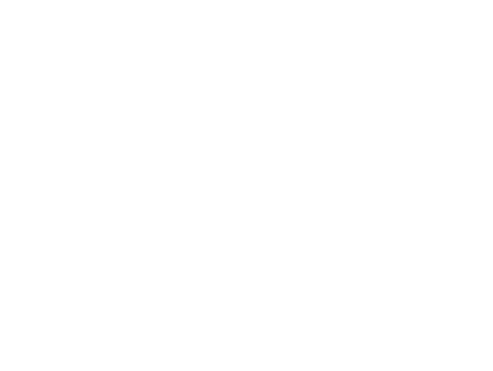
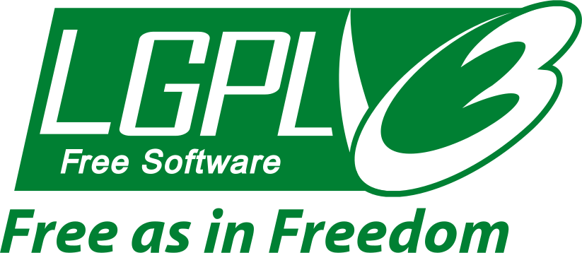

​
Something is not quite right with cybersecurity. As our industry slowly realizes how big of an issue it is, the more we seem to be failing at it. But why is this the case?
​
## The Phantom Menace
​
The number of programmers in the world is doubling roughly every five years \[1\].
If you think about it, this means that at any given point in time, half the programmers
have less than five years of experience.
As long as this is the case we will never have enough experts and the
demand for seasoned engineers can never be satisfied.
​
This keeps our industry in a constant state of inexperience.
Even worse, there is no escape from this: the demand for developers just keeps on increasing
as software is devouring our society as a whole.
And boy, is that software ugly.
That software is the worst million lines of legacy braindeath nobody dares to touch at your
organisation.
We all have it, we've all seen it and we all know it's not going away anytime soon.
​

​
If you throw security into this whole mix, it gets even worse.
ITSec still seems to be an exotic topic at universities and
we have generations of professionals stuck without a proper background in security and
there is not much we can do about that.
​
At this point, our best bet is to try and build a culture of conscious developers.
Software craftsmanship is an excellent starting point, providing an approach to software
development which is capable of resolving many of the issues plaguing our industry.
However, even in an utopian world filled with responsible professionals,
security issues would still require some special treatment
(training, QA, security audits, pentesting, etc.).
​
Security shouldn't be just an afterthought or just an other feature on our backlogs.
Our whole industry is built on technologies where we've "hacked in" security after something
went _seriously_ wrong.
It seems like this is not really sustainable anymore and perhaps
it's time we took a different approach:
We should design and build our software systems with security in mind from the ground up.
The only way we could achieve this is by making education a whole lot more accessible and fun.
​
Of course this issue is far too complex to simply be solved by some magical new idea or
technology, but with some luck and tons of determination we just might make it together,
one step at a time.
​
\[1\]: "Uncle" Bob Martin - The Future of Programming
​
## A New Hope
​
Our company has a long history of building hacking labs and CTF challenges.
These exercises provide awesome hands-on experience,
but their learning curve can be quite steep without a strong background in security.
Our goal was to make these exercises more accessible without sacrificing their teaching potential.
​
The Tutorial Framework (TFW) allows you to create interactive learning environments running inside containers.
These environments are capable of automatically guiding users through a set of topics by allowing them to interact with real software through a simple web browser.
Users can attack web services, write some code to fix the vulnerabilities they've just exploited
and use a terminal to deploy their changes.
The framework gives you tools to track user progress, run test cases to check their solutions and even offer context dependent help based on the results.
​
Sounds cool, doesn't it? You can take the whole thing on a test drive
[right here](https://platform.avatao.com/paths/c48297cb-5964-4a85-a444-584ae10af983/challenges/03ee550c-62cb-4dd9-8438-a20cea6de668)!
​
This framework allowed us to create tutorials in which you still get that "oh I've hacked something"
breeze, but you are not on your own and have interactive help during the process.
We've been using this tool internally for more than a year now and created around 200 exercises with it.
A few months ago we've decided to open source it right before DevSecCon Seattle, where I
gave a short talk on it.
​
## Our Naboo Royal Starship
​
The framework is essentially a set of useful components for building interactive labs.
These include, but are not limited to:
​
- Chat to communicate with the user
- Code editor (IDE) and console
- A terminal
- Process management, live process logs
- Finite state machines to track user progress
​
These built-ins are quite modular, so developers can opt-in to choose the ones they want to
use in their tutorials.
All of them come with sane defaults, but are also heavily customizable, so for instance
you would be able to instruct the code editor to only show `.py` files under a given path, or
change which process has its live logs displayed in the console.
Most of our built-ins are implemented as backend services communicating with Angular components
on the frontend.
​
The framework also offers tooling to deal with:
- Running arbitrary processes inside your container (supervisord)
- Reverse proxying webservers, so the whole thing is exposed over a single port (nginx)
- Reaping zombie processes (tini)
- Integrating a web application into our frontend (so it's right next to a code editor with it's source tree for instance)
- and more ...
​
The whole package is conveniently shipped as a Docker baseimage available on [DockerHub](https://hub.docker.com/r/avatao/baseimage-tutorial-framework).
​
## Welcome on Board!
​
The foundation of the framework is a messaging system built on [ZeroMQ](https://zeromq.org).
This IPC mechanism can be used to orchestrate and monitor the built-ins mentioned in the
previous section.
It is implemented as a daemon called TFW server, with the purpose of providing a
robust way for processes to communicate with each other and the TFW frontend.
​
We send and receive simple JSON messages to do RPC and event advertisement over this IPC system.
For example sending the following JSON message to the TFW server would
display a message in the chat on the frontend:
​
```
{
    "key": "message.send",
    "message": "Hey there!",
}
```
​
Or you could use the following message to type and execute `ls` in the built-in terminal on
the frontend (note the `\n`, without that it would just pre-type the command for the user):
​
```
{
    "key": "terminal.write",
    "command": "ls\n"
}
```
​
You get the picture.
​
When something of note happens, the framework advertises these events by broadcasting
similar messages.
A simple example would be the message triggered by the user typing something in the code editor on the frontend:
​
```
{
    "key": "ide.write",
    "content": "I like cats"
}
```
​
Creating an exercise with the framework usually involves subscribing to these events and
deciding what should happen based on the current state of the tutorial and the received message.
For instance you could listen for `ide.write` events, try to compile & run the code found
in the `content` field and notify the user of success when the code passes certain test cases.
​
## Disassembling the Hyperdrive
​
On a high level the framework looks like this:
​

​
The TFW server could be described as a router.
Its job is routing messages between
processes running inside the container (ZMQ) and the frontend (WebSockets).
Processes capable of receiving messages from the TFW server are called _handlers_.
All of our built-in components are implemented as such processes.
Our frontend is a simple Angular web application.
​
Routing decisions are based on the optional `scope` field of messages.
By default every message is forwarded to the backend (ZMQ) side.
With setting the value of `scope`, it is possible to override this default behaviour and
talk to the frontend directly (WebSockets) or even broadcast messages to both sides.
​
Our frontend is mostly just a thin display layer, all logic and state tries to "live" on the backend.
Furthermore, client code is never required to send messages directly to the frontend, as
our components try to expose a simple API and abstract this whole "routing between frontend and backend" deal away.
This means that our built-in handlers negotiate with the frontend on their own to hide this complexity
from challenge developers, so that they won't have to worry about _how_ the whole thing works.
In addition, this also gives us a great deal of engineering flexibility, as we could potentially
rewrite the entire frontend without breaking any client code.
​
Given this modular architecture, you could consider every handler a plug-in to the framework.
This approach forces a layer of isolation between components, reducing coupling and keeping
individual parts simple, reusable and testable.
For instance, changes to the IDE handler will not affect other parts of the system, making it harder
to introduce fragility and increasing overall fault tolerance.
This flexibility makes adding new features a really simple and painless procedure
while reducing the chances of breaking something as well.
​
One such plug-in is our pipe IO subsystem, which allows you to communicate with the framework 
over POSIX named pipes.
Developers can just simply use the `open()`, `write()` and `read()` system calls, pretending that
they are writing and reading files without `seek()`.
This is practical if you wished to avoid indulging yourself in the wonders of socket programming.
​
By default the `/run/tfw` directory is being monitored for file system events (via inotify) by the
framework, allowing us to send and receive messages from a simple bash shell:
​
```
[user@448c2ccf2b55 ~]$ cd /run/tfw/
[user@448c2ccf2b55 tfw]$ # this will be detected by the framework:
[user@448c2ccf2b55 tfw]$ mkfifo send recv
[user@448c2ccf2b55 tfw]$ ls
recv  send
[user@448c2ccf2b55 tfw]$ # receive a single message:
[user@448c2ccf2b55 tfw]$ head -1 recv
{"content": "some text", "filename": "/home/user/workdir/cica", "key": "ide.write"}
[user@448c2ccf2b55 tfw]$ # write to the chat by sending a message:
[user@448c2ccf2b55 tfw]$ echo '{"key": "message.send", "message": "I came from a fifo!"}' > send
[user@448c2ccf2b55 tfw]$ 
```
​
Note that the direction of fifos (send or receive) is determined by their names
(they have to match the pattern `*send*` or `*recv*`).
​
## Giving back to the community
​

​
The Tutorial Framework is available on GitHub and it is licensed under the GNU LGPLv3.
​
Check out our repositories:
​
- [https://github.com/avatao-content/baseimage-tutorial-framework](https://github.com/avatao-content/baseimage-tutorial-framework)
- [https://github.com/avatao-content/frontend-tutorial-framework](https://github.com/avatao-content/frontend-tutorial-framework)
- [https://github.com/avatao-content/test-tutorial-framework](https://github.com/avatao-content/test-tutorial-framework)
​
Feedback, contributions or questions are very welcome. 
Thank you for reading!