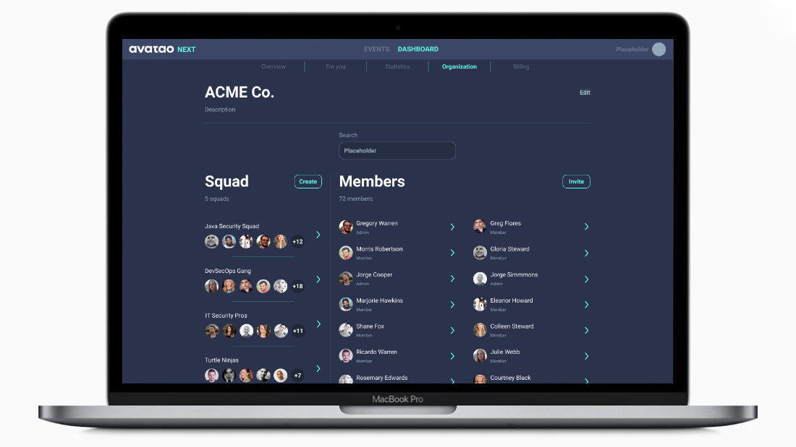
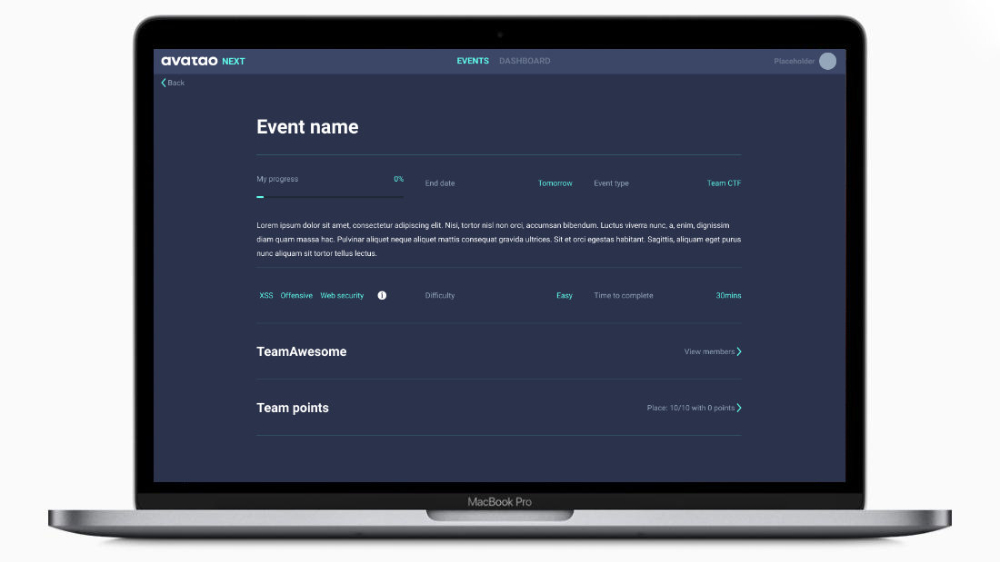

​

## Why Avatao Next?

Well, let's start from the very beginning. Avatao is a security training company providing really cool - biased personal opinion :) - containerized challenges and tutorials to transform companies from the stalled, pale and chaotic plane of security ignorance to a much better place where security is handled with the proper state of mind and responsibility. To achieve this, we built a platform with nearly a thousand security exercises that help developers hone their skills in a really hands-on and hopefully enjoyable way. At the same time, we implemented some basic features for managers to see the progress of their company. That's it. 

Avatao was always well-known for its reliability and the huge effort we invested into creating relevant challenges that help understand application security from zero to hero. That sounds really cool, however, as time went on we had to learn, sometimes painfully and slowly, but that is our journey. Actually, we learnt a lot from our clients, failures, successes, investors, friends and our "competitors". Without them, we couldn't have taken a huge progress in our way of thinking to change something that didn't work in the past. So what was that?

--- 

## A story of failure and learning

In the early dawn of Avatao in 2014, when we were sitting in one of the rooms of [CrySyS Lab](https://crysys.hu) at the Budapest University of Technology and Economics, Hungary - huge thanks [Levi](https://www.crysys.hu/member/buttyan) for hosting us - , we didn't really know anything about how to build a real product for real clients. We had no idea about target personas or go-to-market strategies. Yepp, we were babies in business. We, [Mark](https://www.linkedin.com/in/felegyhazi/), [Levi](https://www.crysys.hu/member/buttyan) and [me](https://www.linkedin.com/in/gaborpek/) had, however, cumulatively decades of experience in IT security that was enough to realize that application security education is a big failure globally and it's high time to make a change. Existing platforms and training delivery methods were neither cost-effective nor scalable enough to meet the needs of millions of people writing insecure code every day. Building a platform is not a problem of course, however, building a product the succeeds is a totally different story. Due to the lack of experience, infancy of the security market and so on, we ended up creating a platform that is "good fit for all", more precisely it isn't really amazing for anyone. While building the old platform we focused on outputs (i.e., features) instead of outcomes \[1\] \[2\] with unqualified personas (i.e., security experts, university students) in mind.  Naturally, this resulted in complex access control, irrelevant features and a pile of requirements that our clients really wanted, but we couldn't deliver in time. All in all, we had to realize that our platform and code base is not the right vehicle to reach our goal: deliver real, hands-on training that makes a radically positive change in your security culture. Alright, so what to change?

### Organizing users 

The original concept that people learn together (e.g., a group of students at universities, an organization, a department) and may join various communities to get the knowledge they need is great, but... and this BUT is a big one. A single user could access learning paths and challenges at different levels that resulted in many extra lines of code that caused a big headache for us at the end of the day to maintain the code properly. The real cause of this, however, was that we couldn't identify a real target persona who we create this product for. 

So here is the question: do we indent to group university students, developers, security champions or security experts? As there was no clear business model supporting this feature the whole concept of learning communities simply fell apart from the product's point of view. This is something we had to definitely deeply analyze. How to do that? First and foremost, we had to come up with a clear statement about target customers: 

> We mainly target software companies 
> with a few hundred developers at least 
> who are willing to transform their security culture
> via training.

That's great. What's now? We also realized that there is no point in supporting multiple communities per user, as developers are invited with their company email addresses that belong to only one single organization. Wow, this is a real shortcut. This simplification on its own saved our lives from the complexity trap that is quite critical to avoid for a startup. We understood also that larger companies work with various software stacks, and developers are not interested in topics that they don't work with. On top of that, developers located at the same place prefer learning together - I know remote-first companies are exceptions, but their culture by default supports teamwork more closely. This is the point when we reintroduced communities in a slightly different way: __Squads__ are born.

> Squads help group developers around software stack, interest or location inside an organization.

That's great. What else? There are many other things we plan to change and include in the future by keeping ourself to our real goal. Here is a quick overview of organization features for now. 

  * Bulk invite of users 
  * Squad support to group organization users 
  * More in-depth statistics
  * Notifications to engage learning
  * Organization-level event recommendation
  * Career tracks and belt system (coming soon)
  
  
  ### Redesigned learning paths are now called Events
 
 _Learning path_ is a great feature to interlink challenges around a topic such as programming languages or various technologies so as to allow for a continuous flow of learning. We had to face, however, the rough reality that developers don't really invest time to learn in their working hours except there is a trigger that they cannot ignore. One of these, of course, is the call of free pizza on Hacktahons and CTFs. Awesome. We felt like finding something that people really enjoy, but learn from a lot. At this point, we realized that our hard-coded learning paths are not flexible enough to support these on-demand events. We had to come up with a solution that enables security champions to organize more and more from these. This is when the idea of _Events_, namely scheduled Learning Paths, was born. 
 
Is it really that special? Yes, absolutely! By enabling to launch CTFs, Hackthons and Workshops at anytime by just simply picking a date and a sequence of challenges, security champions can lead a real war against the stalled and swampy concept of existing security training methods. 
 
 
 
Got it, but what if I want to use the same sequence of challenges without expiry (e.g., *Continuous learning*, *Onboarding*)? Not an issue at all. Events created without date - permanent Events - work exactly the same way as the concept of learning paths in the old platform. They can be solved at anytime with no constraints. 
 
And this is just the very beginning. What if security champions could add these events to developers' calendar as a reminder that a training is coming? What if developers could now play jointly on these cool events that help them solve problems together? Hmm, it's getting more and more interesting. 

We also know that security champions are overloaded. They have to do code reviews, participate threat modeling sessions, organize security trainings, being involved in security compliances and so on. Zillions of things to do at once. We would love to save as much time as possible for them. That's why we started coming up with features that improves their daily life. Here is a quick checklist:
 
  * Self-served Event creation
  * Permanent and scheduled Events
  * Calendar integration
  * Creating Events for individuals and teams
  * Ability to join a public Event without organization access
  * Assigning Events to Squads
 

### Okay, okay, but what about those who actually learn?

Similarly to organization-level recommendations, developers can now pick from topics they're interested in. Tutorials (not challenges) are now embedded into the platform so we can check users' progress easily. For example, developers don't need to go back to the platform to click on the 'Submit solution' button anymore :)  And this is just the beginning. A lot of improvement is coming next year. 

## A story of success? 

We still don't know if Avatao Next is the silver bullet for all the security training pains, however, it's definitely an answer to a sore problem that is weakening companies for decades now. Our initial release is just the very beginning of a story we build together with our clients and the whole industry. 

## Thank you all!

First and foremost, thank you Avatao team for being with us and taking this amazing step. There were many up and downs, I know, but I believe it made us stronger. Special thank goes to [Alex](https://speedinvest.com/alex-zhigarev/) and [Santiago](https://speedinvest.com/corredoira-jack/) from Speedinvest, one of our investors, for pushing us to take the control back on our processes and product. Last, but not least, kudos for all the people and companies of the security space who work day and night on the brighter future of the services and products we altogether use.

 \[1\]: Joshua Seiden: Outcome over output.
 
 \[2\]: Mellissa Perri: Escaping the build trap - How Effective Product Management Creates Real Value.
