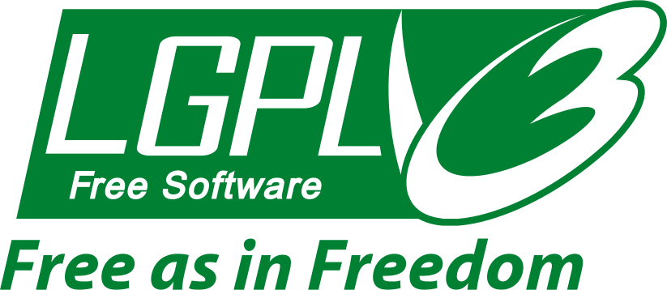

​

## Why Avatao Next?

Well, let's start from the very beginning. Avatao is a security training company providing really cool - biased personal opinion :) - containerized challenges and tutorials to transform companies from the stalled, pale and chaotic plane of security ignorance to a much better place where security is handled with the proper state of mind and responsibility. To achive this, we built a platform with hundreds of security exercises that help developers hone their skills in a really hands-on and hopefully joyful way. At the same time, we implemented some basic features for managers to see the progress of their organization. That's it. 

Avatao was always well-known for its reliability and the huge effort we invested into creating relevant challenges that help understand application security from zero to hero. That sounds really cool, however, as time went on we had to learn - sometimes painfully and slowly, but that is our journey. Actually, we learnt a lot from our clients, failures, successes, investors, friends and our "competitors". Without them, we couldn't have taken a huge progress in our way of thinking to change something that didn't work in the past. So what was that?

--- 

## A story of failure, learning

In the early dawn of Avatao in 2014, when we were sitting in one of the rooms of [CrySyS Lab](https://crysys.hu) at the Budapest University of Technology and Economics, Hungary - huge thanks [Levi](https://www.crysys.hu/member/buttyan) for hosting us - , we didn't really know anything about how to build a real product for real clients. We had no idea about target personas or go-to-market strategies. Yepp, we were babies in business. We - [Mark](https://www.linkedin.com/in/felegyhazi/), [Levi](https://www.crysys.hu/member/buttyan) and [me](https://www.linkedin.com/in/gaborpek/) had, however, cumulatively tens of years of experience in IT security that was enough to realize that application security educations is a big failure globally and it's high time to make a change. Existing platforms and training delivery methods were neither cost-effecitve nor scalable enough to meet the needs of millions of people writing insecure code every day. Building a platform is not a problem of course, however, building a product the succeeds is a totally different story. Due to the lack of experience, infance of the security market and so on, we ended up creating a platform that is "good for all", more precisely it isn't really good for anyone. While building the old platform we focused on outputs (i.e., features) instead of outcomes \[1\] with no clear personas in mind.  Naturally, this resulted in complex access control, irrelavant features and a pile of requirements that our clients really wanted, but we couldn't deliver in time. All in all, we had to realize that our platform and code base is not the right vehicle to reach our goal: deliver real, hands-on training that makes a radically positive change in your security culture. Alright, so what to change?

### Communities vs. Organizations

From technical point of view, one of our biggest problems was the access control of communities. The original concept that people learn together (e.g., group of students at university, an organization, a department) and may join variuos communities to get the knowledge they need is great, but... and this but is a big BUT. A single user could access public, community-private and private paths as well as challenges that resulted in many extra lines of code that caused big headache for us at the end of the day to maintain the code properly. The real cause of this, however, was that we couldn't identify a real target persona whom we create this product for. So here is the question: did we create the feature of *Communities* for university students, developers, security champions or security experts? As there was no clear business model supporting this feature the whole concept of communities simply fell apart from product point of view. This is something we had to definitely deeply dissect. How to do that? First and foremost, we had to come up with a clear statement about target customers 

> We mainly target software companies 
> with a few hundred developers at least 
> who are willing to transform their security culture
> via training.

That's great. What's now? We also realized that there is no point supporting multiple communities per user as developers are registed with their company email address that belong to only one single company. Well, introducing this simplification on its own saved a lot of time and effort which is quite critical in the life of a startup. We understood also that larger companies work with various software stacks and developers are not interested in topics that they don't work with. On the top of that developers located at the same place prefer learning together - I know remote-first companies are exceptions, but their culture by default supports team work more closely. This is the point when we reintroduced communities in a slightly different way: __Squads__ are born. 

> Squads help group developers around software stack, interest or location inside an organization.

Hmm, that seems to be something that is getting closer to the reality. 

  * Bulk invite
  * Squad support to group organization users 
  * More in-depth statistics

  ### __Learning Path vs. Events__
 
 _Learning path_ is a great tool to interlink challenges around a topic such as programming languages or various technologies so as to allow for a continuous flow of learning. We had to face, however, the rough reality that developers don't really invest time to learn on our platform in their working hours except there is a trigger that they cannot ignore. One of these, of course, is the call of free pizza on Hackthons and CTFs. Wow, that is great. We felt like finding something that people really enjoy, they have fun and actually learn a lot. At this point, we realized that our hard-coded learning paths are not flexible enough to support these on-demand events. We had to come up with a solution that enables security champions to organize more and more from these. This is when the idea of _Events_, namely scheduled Learning Paths, was born. Is it really that special? Yes, absolutely! By enabling to launch CTFs, Hackthons and Workshops at anytime by just simply picking a date and a sequence of exercieses, security champions can lead a real war against the stalled and swampy concept of existing security training methods. Wait, this is just the very beginning. What if champions could add these events to developers' calendar so as not to skip them? What if developers could now play jointly on these cool events that help them solving problems together? Hmm, it's getting more and more interesting. We know also that security champions are overloaded. They have to do code reviews, participating threat modeling sessions, organizing security traingings, being involved in security compliances and so on. Zillions of things doing at once. We would love to save as much as time as possible for them. That's why we started supporting recommendation features to custom-tailor security learning to your needs. Here is a quick checklist:
 
  * Self-served Event creation
  * Permanent Events and Events with Scheduling. 
  * Calendar integration
  * Supporting individuals and teams
  * Ability to join a public Event without organization access
  * Assigning Events to Squads

### A story of success?

We still don't know if Avatao Next is the silver bullet for the all the , but it is definitely a right answer to a sore problem that is weakening companies for decades now. 

## Thank you all!

First and foremost, thank you Avatao team for being with us and taking this amazing step. There were many up and downs, I know, but I believe it made us stronger. Special thank goes to [Alex](https://speedinvest.com/alex-zhigarev/) and [Santiago](https://speedinvest.com/corredoira-jack/) from Speedinvest for pushing us to take the control back on our processes and product. Last, but not least, kudos for all the people and companies of the security space who work day and night on the brighter future of our services and products.

 \[1\]: Joshua Seiden - Outcome over output.
